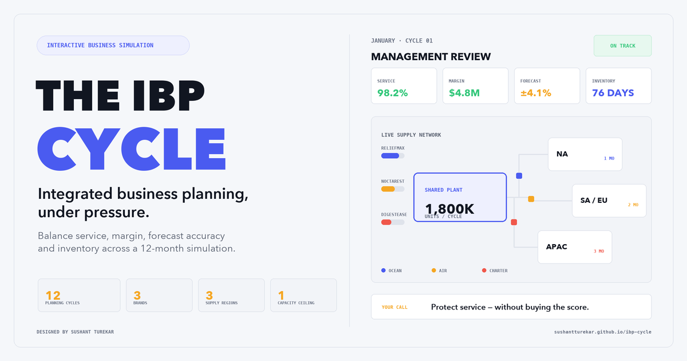

# The IBP Cycle

A browser-based integrated business planning simulator. Twelve monthly planning
cycles across three consumer-health brands and three supply regions, scored on
service, margin, forecast accuracy and inventory position.

**[Play it →](https://sushantturekar.github.io/ibp-cycle/)**

Best on a desktop or laptop. It runs on a phone, but the planning screens are
dense and the network map is wide.

## What it models

Three brands across three supply regions on one, two and three-month lead times.
What you build today does not help today — that single constraint drives
everything else.

**Two-layer demand.** Consumers buy at the shelf; retailers order from you. You
forecast and ship sell-in, and you see consumption a month late. When the two
diverge, the trade is moving its own inventory, and it always reverses.

**A binding capacity ceiling.** Overtime is available at a COGS premium that
escalates the longer you lean on it. One clean month resets it.

**Freight as a decision.** Ocean is the baseline. Air lands next cycle at four
times the rate. Emergency charter lands inside the current cycle at ten times —
the only thing in the model that beats a lead time.

**Carrying cost and obsolescence**, charged on stock and on goods in transit.

**Conflicting inputs.** Every signal carries a source line. One is a verbal promo
claim with no mechanic, funding line or account list behind it. Reading that is
the skill being tested.

## Design notes

**Consumption is reported a month late.** You forecast and ship sell-in — what
retailers order — but you only see what shoppers actually bought a month
afterwards. The gap between the two is the trade moving its own inventory, and it
always reverses.

**Overtime escalates on consecutive use.** A flat premium turns overtime into a
standing policy. Escalating it prices the thing that is actually expensive —
reliance on it — while leaving a single tactical month cheap.

**Charter is capped, and only moves units already built.** Air is the one thing
that beats a lead time, so without limits it solves every mistake. The cap stops
you buying your way out of a bad quarter; the build constraint means air fixes
where stock is, never how much of it exists.

**Carrying cost applies to goods in transit.** A container on the three-month
lane is working capital for three months. Charging warehouse stock alone would
make the longest lane look like the cheapest one.

**One input is deliberately unsourced.** Every signal shows its provenance. One
is a verbal claim of a 40% promotional lift with no mechanic, no funding line and
no participating accounts on file. Checking that line before believing the number
is the most transferable habit in the model.

**Overstock is punished as hard as stockout.** Inventory position carries 20 of
100 points and the target is a band, not a floor. Forty days over costs what
forty days under costs, because a planner who never misses and never explains the
working capital is doing half the job.

## You report to someone

Anneke Vos, SVP Global Supply Chain, reacts to every cycle you close. Her
standing in you moves with your recent months rather than your whole year. Let it
fall far enough and the run ends there — though nothing is fatal before the end
of Q1.

## Scoring

100 points: case fill rate 30, margin capture 25, inventory position 20, forecast
error 15, bias 10. Stocking out and overstocking are both punished.

Auto-filling the statistical baseline every cycle scores about 33. Beat that and
you are adding value over the model.

Demand is drawn from a fixed seed, so everyone plays the same twelve months and
replaying tests judgement rather than luck.

## Modes

**Sandbox** — untimed. Best for a first run.
**Career** — two minutes a cycle, commits automatically when the clock runs out.
**Pressure** — one minute a cycle, capacity short all year, consumption data two
months late.

## Notes

Illustrative CPG economics throughout. No company data is used anywhere in this
model.

---

© 2026 [Sushant Turekar](https://www.linkedin.com/in/sushantturekar/). All rights
reserved. Concept, model design and scenario architecture are the original work
of the author. Not licensed for redistribution or derivative use without written
permission.
